# Customer Support Agent

Teaching codebase for a production-style LLM customer support copilot built with FastAPI, Streamlit, LangChain, Groq, ChromaDB, and Mem0.

## Quickstart

```bash
uv sync --dev
uv run python -m spacy download en_core_web_sm

# Install guardrails-ai hub validators (requires a free API key)
export GUARDRAILS_API_KEY=...   # from https://hub.guardrailsai.com
uv run guardrails configure --token=$GUARDRAILS_API_KEY --disable-metrics --disable-remote-inferencing
uv run guardrails hub install hub://guardrails/detect_pii
uv run guardrails hub install hub://guardrails/toxic_language
uv run guardrails hub install hub://tryolabs/restricttotopic

uv run python main.py
uv run streamlit run app.py
```

The API starts on `http://localhost:8000` and the dashboard starts on `http://localhost:8501`.

> If `GUARDRAILS_API_KEY` is unavailable, the service falls back to custom guardrails-ai `Validator` subclasses that use regex-based PII / toxicity / scope checks. The hub validators are recommended for production because they use ML classifiers (Presidio for PII, a HuggingFace toxicity model, an LLM-backed topic classifier).

## Evals & Guardrails

This repo now includes a lightweight responsible-AI layer around every draft-generation flow:

- Input guardrails redact structured PII and reject off-topic requests.
- Output guardrails redact leaked PII, block toxic drafts, and block forbidden financial promises.
- Local JSONL traces capture sanitized prompts, retrieval hits, tool calls, outputs, latencies, and guardrail outcomes.
- Offline evals live under [`evals/README.md`](evals/README.md) with a committed golden dataset, smoke checks for PRs, and a full nightly suite.

```text
┌──────────────────┐
│   API Request    │
└────────┬─────────┘
         ▼
┌──────────────────────┐
│  SupportCopilot      │
│  generate_draft()    │
└────────┬─────────────┘
         ▼
┌──────────────────────┐    ┌────────────────────────┐
│ GuardrailsService    │───▶│  PII redactor          │
│ .check_input()       │    │  Topic/scope validator │
└────────┬─────────────┘    └────────────────────────┘
         ▼
┌──────────────────────┐    ┌────────────────────────┐
│ Tracer.start_span()  │───▶│ /data/traces/*.jsonl   │
└────────┬─────────────┘    └────────────────────────┘
         ▼
┌──────────────────────┐
│ LangChain Agent +    │
│ ChatGroq + Tools +   │
│ ChromaDB + Mem0      │
└────────┬─────────────┘
         ▼
┌──────────────────────┐    ┌────────────────────────┐
│ GuardrailsService    │───▶│ Toxicity + tone        │
│ .check_output()      │    │ No-financial-promises  │
└────────┬─────────────┘    └────────────────────────┘
         ▼
   Draft + context_used
```

## Local Verification

```bash
uv run pytest tests -q
uv run pytest evals/test_guardrails.py -q
uv run pytest evals/test_smoke_eval.py -q
uv run pytest -m full_eval evals/test_full_eval.py -q
uv run python evals/run_eval_report.py
```


I'll explore the codebase to understand the eval and guardrails setup. Let me launch parallel agents to cover all the relevant areas.

Excellent — I have full coverage of the codebase. Let me write the plan file with all the diagrams and explanations.

Since this is a research/explanation task (no code to implement), I'll present the full explanation directly.

---

## Evals & Guardrails — Complete Walkthrough

---

### 1. Overall System Architecture

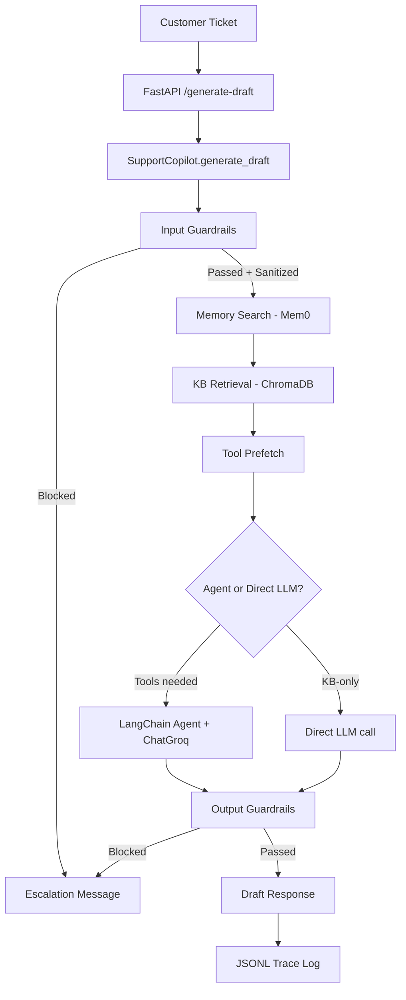

---

### 2. The 3-Layer Testing Pyramid

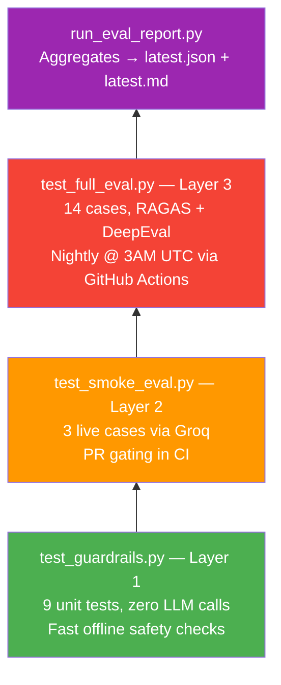

---

### 3. Use Cases Covered by the Golden Dataset

graph LR

    ROOT["14 Golden Test Cases"]

    subgraph ATM["ATM Operations"]
        A1["ATM Standard Limit"]
        A2["ATM Cash Debited Reversal"]
        A3["ATM Wrong PIN Manual Reset"]
        A4["ATM PIN Safety Guidance"]
    end

    subgraph FEES["Fees and Balance"]
        B1["Urban Minimum Balance"]
        B2["Non-Maintenance Fee"]
        B3["Closure Within 14 Days"]
        B4["SMS Alert Fee"]
    end

    subgraph KYC["KYC and Profile"]
        C1["Low Risk KYC Frequency"]
        C2["Accepted Address Proof"]
        C3["Email Update Timing"]
    end

    subgraph PLAN["Plan-Aware Scenarios"]
        D1["Plan ATM Issue Priority"]
        D2["Plan KYC Update Priority"]
        D3["Plan Minimum Balance Priority"]
    end

    ROOT --> ATM
    ROOT --> FEES
    ROOT --> KYC
    ROOT --> PLAN

> The 3 **plan-aware** cases are the only ones that test **tool calls** (`lookup_customer_plan`).

---

### 4. Full Eval Execution Flow

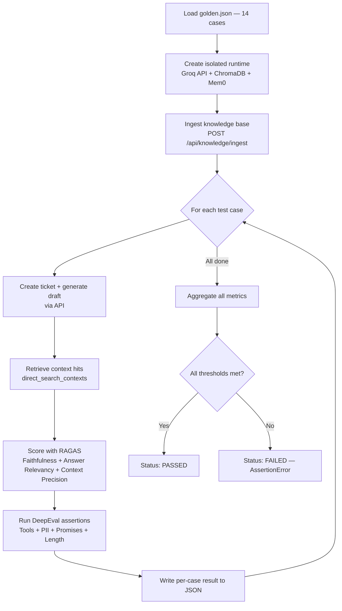

---

### 5. Dual-Framework Strategy

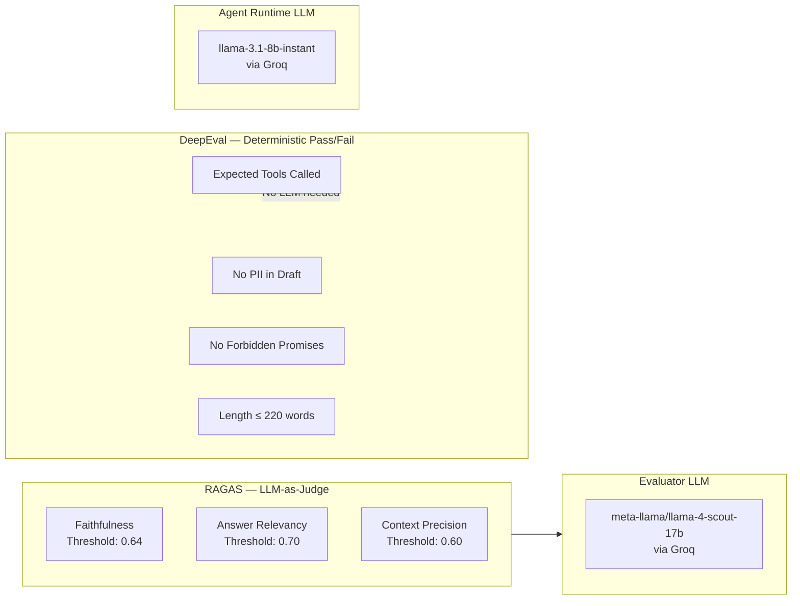

**Why two frameworks?** RAGAS catches quality regressions that are hard to express as rules (hallucination, relevance). DeepEval catches hard correctness failures that shouldn't need an LLM to judge (PII leak, promised returns).

---

### 6. RAGAS Metrics — Definition & Rationale

#### Faithfulness (threshold: 0.64)
**What it measures:** Is every claim in the draft actually supported by the retrieved KB chunks?

**How it works:**
```
Draft answer → RAGAS LLM decomposes into atomic claims
Each claim → checked against retrieved context
Score = supported_claims / total_claims
```

**Why for a banking bot:** The agent must not hallucinate banking rules (e.g., inventing ATM limits). Faithfulness is the primary hallucination guard.

---

#### Answer Relevancy (threshold: 0.70)
**What it measures:** Does the response actually answer the customer's specific question?

**How it works:**
```
Draft answer → RAGAS LLM generates N reverse-questions
Each reverse-question → embedded and compared to original query
Score = cosine similarity average
```

**Why for a banking bot:** A response can be faithful (grounded) but still not answer what was asked. This catches tangential or evasive drafts.

---

#### Context Precision (threshold: 0.60)
**What it measures:** Are the TOP-ranked retrieved chunks the ones that actually matter?

**How it works:**
```
Retrieved chunks ranked 1..k
Ground-truth relevant chunks (from golden.json expected_sources)
Score = precision@k weighting — high-rank relevant chunks score better
```

**Why for a banking bot:** This tests the **RAG retrieval quality**, not the LLM. Low context precision means irrelevant KB chunks are ranked above useful ones, degrading the whole pipeline. Importantly, this uses `NonLLMContextPrecisionWithReference` — no LLM needed, purely reference-based.

---

### 7. DeepEval Metrics — What They Check

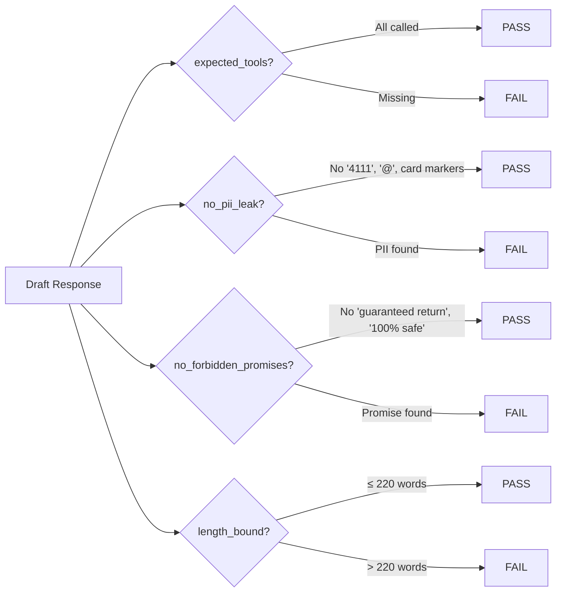

---

### 8. Guardrails Architecture (Input → Output)

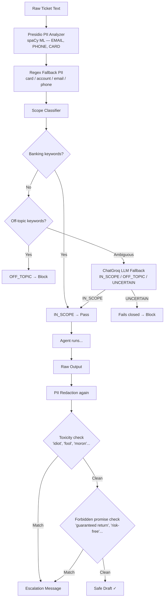

---

### 9. CI/CD Integration

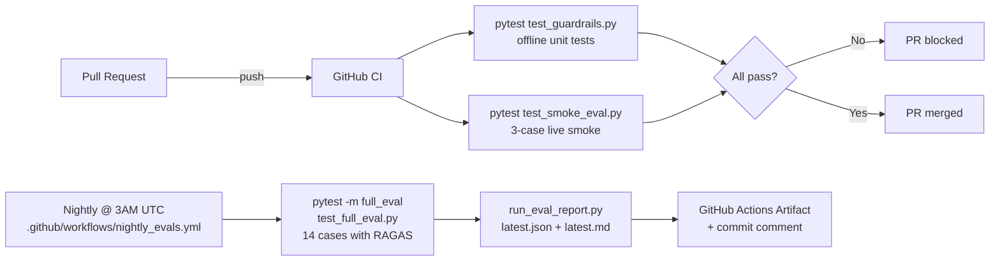

---

### 10. How to Run Each Layer

```bash
# Layer 1 — Offline guardrails (no API key, fast)
pytest evals/test_guardrails.py -v

# Layer 2 — Smoke eval (needs GROQ_API_KEY, ~3 cases)
GROQ_API_KEY=gsk_... pytest evals/test_smoke_eval.py -v

# Layer 3 — Full eval with RAGAS + DeepEval (nightly)
GROQ_API_KEY=gsk_... pytest -m full_eval evals/test_full_eval.py -v

# Generate aggregated markdown + JSON report after full eval
python evals/run_eval_report.py
# → evals/reports/latest.json
# → evals/reports/latest.md
```

---

### 11. Latest Results (April 19, 2026 — 14/14 cases)

| Metric | Score | Threshold | |
|--------|-------|-----------|---|
| Faithfulness | 0.6505 | 0.64 | ✅ |
| Answer Relevancy | 0.7425 | 0.70 | ✅ |
| Context Precision | 1.0000 | 0.60 | ✅ |
| Expected Tools | 100% | 100% | ✅ |
| No PII Leak | 100% | 100% | ✅ |
| No Forbidden Promises | 100% | 100% | ✅ |
| Length Bound | 100% | 100% | ✅ |

**Overall: PASSED**

---

### Key files to reference

| File | Purpose |
|------|---------|
| [evals/test_full_eval.py](evals/test_full_eval.py) | Full eval suite — RAGAS + DeepEval scoring |
| [evals/test_smoke_eval.py](evals/test_smoke_eval.py) | 3-case PR smoke test |
| [evals/test_guardrails.py](evals/test_guardrails.py) | Offline guardrails unit tests |
| [evals/_test_support.py](evals/_test_support.py) | Shared runtime + RAGAS wrappers |
| [evals/generate_dataset.py](evals/generate_dataset.py) | Golden dataset generator (35 blueprints, 14 active) |
| [evals/dataset/golden.json](evals/dataset/golden.json) | Committed test cases |
| [evals/reports/latest.md](evals/reports/latest.md) | Latest eval report |
| [customer_support_agent/services/guardrails_service.py](customer_support_agent/services/guardrails_service.py) | Full guardrails implementation |
| [.github/workflows/nightly_evals.yml](.github/workflows/nightly_evals.yml) | CI/CD automation |


I'll explore the codebase to understand the evals and guardrails setup. Let me launch parallel agents to cover the full picture.

Excellent — I now have a complete picture. Let me write the plan file with full Mermaid diagrams for your visual learning style.

Here's the complete breakdown of your evals & guardrails system. Everything is also saved to the plan file with all diagrams.

---

## What the Eval Pipeline Covers

The golden dataset (`evals/dataset/golden.json`) has **30+ test cases** across these categories:

| Category | Example |
|---|---|
| ATM / Cash | "ATM debited me but gave no cash" |
| Card & Account | "Card declined abroad", "KYC update needed" |
| Charges & Billing | "Unexpected deduction", "Min balance violation" |
| Savings Rules | Interest rates, FD maturity |
| Scope Rejection | Off-topic (poetry, recipes) → should be blocked |
| PII Handling | Inputs with real card numbers → should be redacted |
| Forbidden Promises | Responses that guarantee returns → should be blocked |

---

## 3 Levels of Eval Rigor

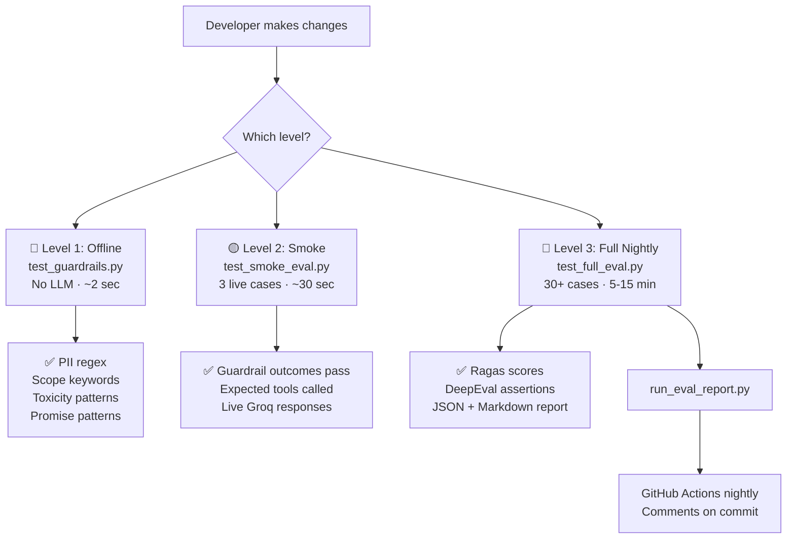

**How to run:**
```bash
# Level 1 — free, instant
uv run pytest evals/test_guardrails.py -v

# Level 2 — needs GROQ_API_KEY
uv run pytest evals/test_smoke_eval.py -v

# Level 3 — full suite
uv run pytest -m full_eval evals/test_full_eval.py -v
uv run python evals/run_eval_report.py
```

---

## Frameworks Used and Why

```mermaid
flowchart LR
    subgraph Runtime["🏃 Agent Runtime"]
        LC[LangChain\nAgent + tool binding]
        Groq[Groq LLM\nllama-3.1-8b-instant]
        Chroma[ChromaDB\nRAG vector store]
        Mem0[Mem0\nPer-customer memory]
    end

    subgraph Guardrails["🛡️ Guardrail Libraries"]
        Presidio[Microsoft Presidio\nPII detection]
        spaCy[spaCy\nNLP backbone for Presidio]
        GuardrailsAI[Guardrails-AI 0.5\nOutput validation layer]
    end

    subgraph Evals["📊 Eval Frameworks"]
        Ragas[Ragas 0.2\nRAG quality scoring\nneeds LLM as judge]
        DeepEval[DeepEval 1.0\nDeterministic assertions\ncustom BaseMetric classes]
        pytest[pytest\nTest runner + markers]
    end

    Runtime --> Guardrails
    Guardrails --> Evals
```

---

## Guardrail Levels — Where They Fire

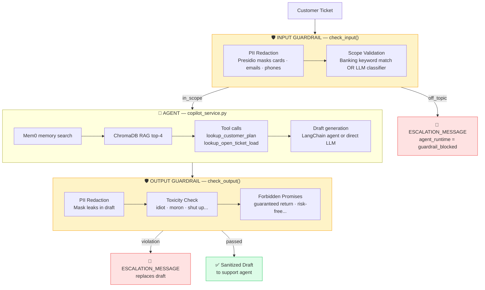

---

## All Metrics — What, Why, and Thresholds

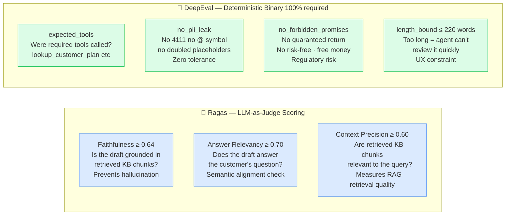

### Why These Specific Metrics?

| Metric | Why This One Specifically |
|---|---|
| **Faithfulness (0.64)** | Banking advice MUST cite policy — hallucinated SLA times or charges cause real financial harm. Not 1.0 because LLMs paraphrase rather than quote verbatim. |
| **Answer Relevancy (0.70)** | A factually correct reply that ignores the actual question is useless to a support agent. |
| **Context Precision (0.60)** | If RAG fetches wrong KB chunks, the whole pipeline degrades — this catches retrieval rot early. |
| **Expected Tools (100%)** | Skipping `lookup_customer_plan` means wrong SLA/priority info — binary correctness needed. |
| **No PII Leak (100%)** | Leaking a card number is a compliance violation, not a quality tradeoff. Zero tolerance. |
| **No Forbidden Promises (100%)** | "Guaranteed return" in a bank message = legal liability. Regulatory, not optional. |
| **Length Bound (100%)** | >220 words is too long for a human to scan and approve quickly — pure UX constraint. |

---

## Overall Pass/Fail Logic

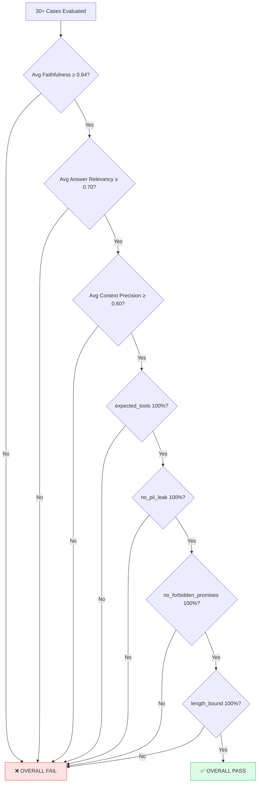

---

**Quick summary:** You have a 3-tier eval system — offline guardrail unit tests → live smoke (3 cases, PR gating) → full nightly suite (30+ cases). Guardrails fire at two points: input (blocks off-topic/PII before the agent runs) and output (blocks toxic/promise-violating drafts after generation). Metrics split into two families: Ragas for probabilistic RAG quality with score thresholds, and DeepEval for binary safety assertions that must be 100%.


Let me read the relevant files directly to give you precise answers.

That confirms the key insight for question 4. Now I have everything. Here are your answers:

---

## Cross-Questions Answered

---

### 1. How is the isolated runtime created?

It's a **Python context manager** that hijacks environment variables temporarily so the entire FastAPI app boots fresh in a pytest `tmp_path` sandbox.

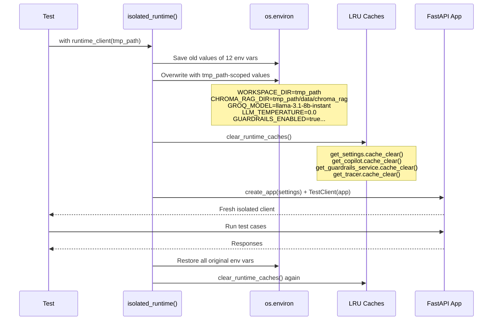

**Why this design?** Each test run gets a blank ChromaDB, blank Mem0 store, blank trace dir — all isolated to `tmp_path` which pytest auto-deletes after the test. The production code never changes; only the env vars that `Settings()` reads change. The cache clears are critical — without them, the `@lru_cache` on `get_copilot()` would return the old production singleton.

Relevant code: [evals/_test_support.py:158](evals/_test_support.py) (`isolated_runtime`) and [evals/_test_support.py:199](evals/_test_support.py) (`runtime_client`).

---

### 2. What are DeepEval assertions and why DeepEval (not RAGAS) for them?

**What they are:** In this project, DeepEval assertions are **pure Python functions wrapped inside a `DeterministicMetric` class** that plugs into DeepEval's test harness. There is zero LLM involved.

```python
# The wrapper — DeepEval just calls .measure() and checks .success
class DeterministicMetric(BaseMetric):
    def measure(self, test_case: LLMTestCase) -> float:
        passed, reason = self.evaluator(test_case)  # ← your plain Python function
        self.score = 1.0 if passed else 0.0
        self.success = passed
        return self.score
```

**Why NOT RAGAS for these?**

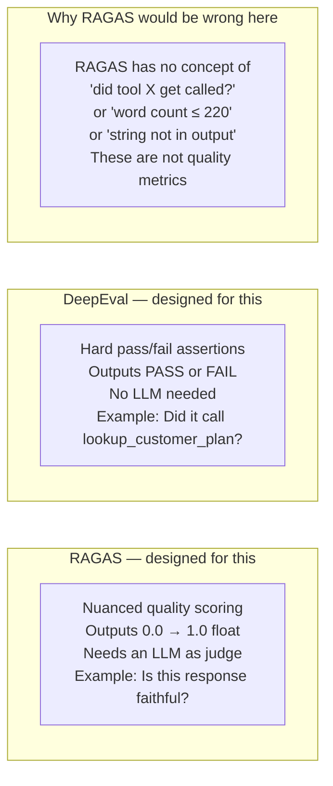

**What DeepEval specifically provides here:**
- `LLMTestCase` — a structured object that carries `actual_output`, `tools_called`, `retrieval_context` together
- `assert_test()` — runs a metric and raises `AssertionError` with a clean reason if it fails
- `ToolCall` — a typed container to record which tools were called with what args

RAGAS doesn't have `ToolCall`, doesn't have a "was this tool called" metric, and isn't designed for string-presence checks. DeepEval is the right harness for **binary assertions about LLM behavior**.

---

### 3. How PII and forbidden promises are detected WITHOUT any LLM?

Both use **compiled Python regex** (`re.compile`). No model, no API call, no network.

#### PII Detection — Two-layer approach:

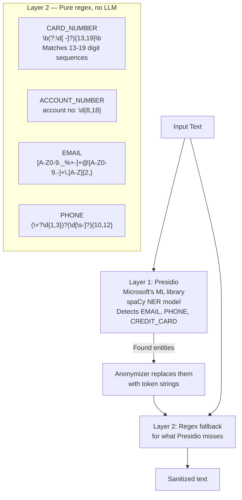

Presidio handles the hard cases (emails inside sentences, formatted phone numbers). Regex mops up structured patterns like card numbers and account numbers that are easy to pattern-match.

#### Forbidden Promise Detection — Pure regex, always:

```python
_FORBIDDEN_PROMISE_PATTERNS = [
    re.compile(r"\bguaranteed return\b", re.IGNORECASE),
    re.compile(r"\b100%\s+safe\b",       re.IGNORECASE),
    re.compile(r"\brisk[- ]free\b",       re.IGNORECASE),
    re.compile(r"\bdouble your money\b",  re.IGNORECASE),
    # ... 4 more
]
```

`re.finditer()` scans the output. If any pattern matches → blocked. The `\b` word-boundary anchors prevent false matches ("risk-free" doesn't match "risk-freely"). This is **instant, deterministic, and free** — no LLM latency, no rate limits.

---

### 4. DeepEval vs Guardrails-ai — Who is actually doing the guardrails work?

**Your instinct is exactly right, and here is the truth:**

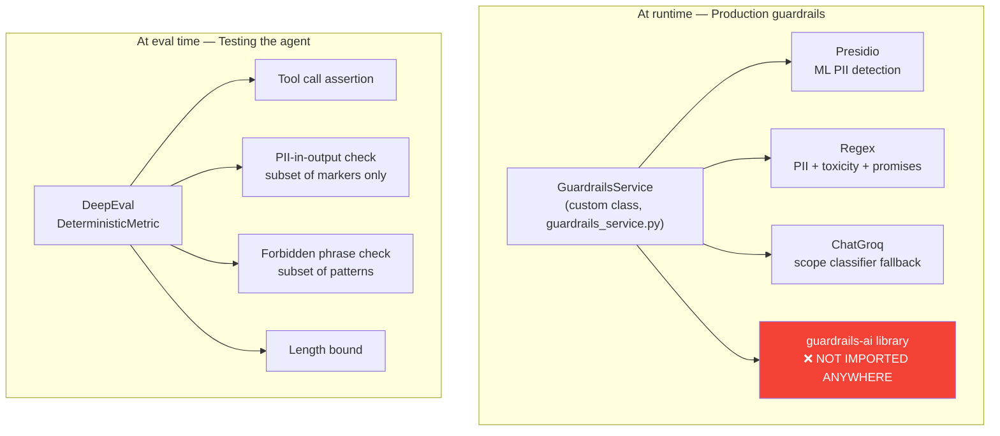

**The shocking finding:** `guardrails-ai` is listed in `pyproject.toml` as a dependency but **is never imported anywhere in the codebase**. Zero usages. It's a dead dependency — the whole guardrail logic is implemented from scratch in [`guardrails_service.py`](customer_support_agent/services/guardrails_service.py) using Presidio + regex + a ChatGroq scope classifier.

**So who does what:**

| Concern | At Runtime (Production) | At Eval Time (Testing) |
|---|---|---|
| PII detection | `GuardrailsService` + Presidio + regex | DeepEval `no_pii_metric()` checks a few marker strings |
| Forbidden promises | `GuardrailsService` + regex (8 patterns) | DeepEval `no_promise_metric()` checks 5 phrase substrings |
| Scope validation | `GuardrailsService` + keywords + LLM | Not tested in evals |
| Toxicity | `GuardrailsService` + regex | Not tested in evals |
| Tool calls | Agent runtime | DeepEval `tool_metric()` verifies post-hoc |
| Response quality | Not checked at runtime | RAGAS scores faithfulness, relevancy, precision |

**The key conceptual split:**
- **`GuardrailsService`** = the actual production safety gate. It runs on every real request and can **block** responses.
- **DeepEval assertions** = the eval-time regression tests that **verify** the guardrails worked correctly across the 14 golden cases. They're not doing the guardrailing — they're checking that guardrailing happened correctly.

Think of it like: `GuardrailsService` is the seatbelt. DeepEval is the crash test that verifies the seatbelt held.