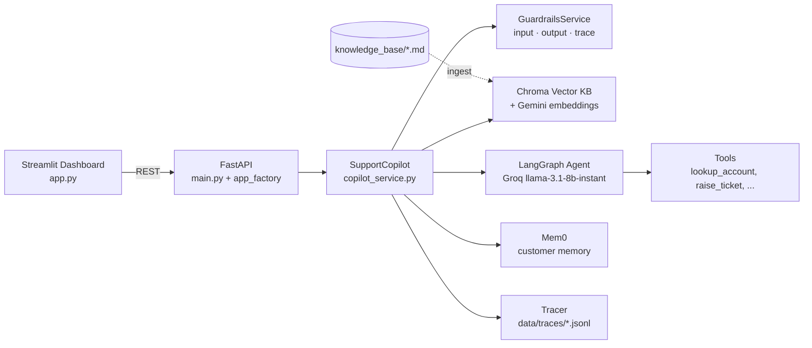
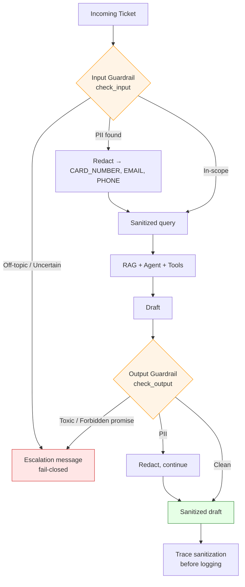
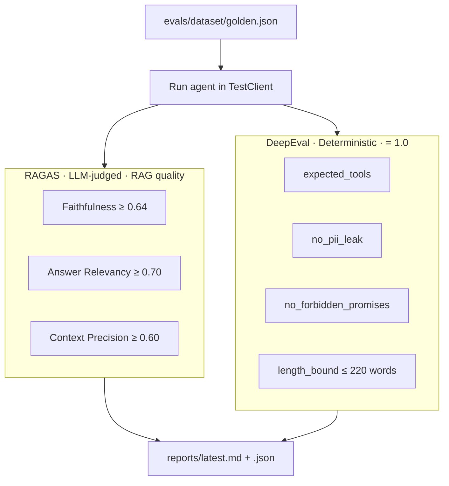

# Customer Support Copilot

> AI copilot that drafts banking support replies — grounded in a knowledge base, tool-using, guarded at input & output, traced end-to-end, and continuously evaluated.

**Stack:** Python 3.11 · FastAPI · Streamlit · LangChain + LangGraph · Chroma · Mem0 · Groq (Llama-3.1) · Guardrails AI · RAGAS · DeepEval · Docker.

---

## What it does

A support agent opens a ticket in the Streamlit dashboard. The FastAPI backend retrieves relevant policy snippets from a Chroma vector KB, runs a LangGraph agent (with tools like account lookup), drafts a reply, and runs the draft through a guardrail layer before returning it. Every step is traced; a nightly CI job evaluates the whole pipeline against a golden dataset.

---

## Architecture



---

## Project layout

```
.
├── main.py                       # FastAPI entrypoint
├── app.py                        # Streamlit dashboard
├── customer_support_agent/
│   ├── api/                      # FastAPI app factory + routers + DI
│   ├── core/                     # settings, logging
│   ├── services/                 # copilot, guardrails, rag, agent, memory
│   ├── integrations/             # groq, chroma, mem0, embeddings
│   ├── observability/            # tracer
│   ├── repositories/             # ticket / draft stores
│   └── schemas/                  # pydantic models
├── knowledge_base/               # banking policy docs (.md) ingested into Chroma
├── evals/                        # eval suite (RAGAS + DeepEval) + golden dataset
├── tests/                        # unit tests
├── docs/EC2_deployment_flow.md   # production deploy notes
├── .github/workflows/            # nightly eval CI
├── docker-compose.yml            # api + dashboard services
└── Dockerfile
```

---

## Quickstart

### 1. Prerequisites
- Python 3.11
- [`uv`](https://github.com/astral-sh/uv) package manager
- A free Groq API key (https://console.groq.com)

### 2. Setup

```bash
cp .env.example .env          # then fill in GROQ_API_KEY (and optionally GOOGLE_API_KEY)
uv sync --dev
uv run python -m spacy download en_core_web_sm   # needed by guardrails PII validator
```

### 3. Run locally

```bash
# Terminal 1 — API
uv run python main.py

# Terminal 2 — Dashboard
uv run streamlit run app.py
```

Open http://localhost:8501 for the dashboard, http://localhost:8000/docs for the API.

### 4. Run with Docker

```bash
docker compose up --build
```

This starts:
- `support-copilot-api` on port `8000`
- `support-copilot-dashboard` on port `8501`

### 5. Ingest the knowledge base (first run only)

```bash
curl -X POST http://localhost:8000/api/knowledge/ingest
```

This indexes everything in [knowledge_base/](knowledge_base/) into Chroma.

---

## Configuration

All settings come from `.env` ([template](.env.example)).

| Variable | Default | Purpose |
|---|---|---|
| `GROQ_API_KEY` | — | **Required.** LLM provider for runtime + eval judge |
| `GROQ_MODEL` | `llama-3.1-8b-instant` | Runtime model |
| `GOOGLE_API_KEY` | — | Optional, enables Gemini embeddings (recommended for KB) |
| `OPENAI_API_KEY` | — | Optional alternative embedding/LLM provider |
| `ENABLE_LOCAL_EMBEDDINGS` | `false` | Use sentence-transformers instead of cloud embeddings |
| `GUARDRAILS_ENABLED` | `true` | Master switch for the guardrail layer |
| `GUARDRAILS_API_KEY` | — | Optional — unlocks Guardrails Hub validators (PII, toxicity, topic). Without it, regex fallbacks are used |
| `TRACER_ENABLED` | `true` | Write per-request traces to `TRACER_DIR` |
| `TRACER_DIR` | `data/traces` | Where trace JSONL files land |
| `API_HOST` / `API_PORT` | `0.0.0.0` / `8000` | FastAPI bind |

---

## Knowledge base

Markdown files under [knowledge_base/](knowledge_base/) are the source of truth for the bot:

- `banking-atm-cash-withdrawal-faq.md`
- `banking-charges-and-minimum-balance.md`
- `banking-kyc-and-account-update-rules.md`
- `saving-account-rule.md`

`POST /api/knowledge/ingest` chunks these and embeds them into a local Chroma collection. Re-run after edits.

---

## API surface

| Method | Path | Purpose |
|---|---|---|
| `GET` | `/health` | Liveness probe |
| `POST` | `/api/tickets` | Create a ticket |
| `GET` | `/api/tickets` | List tickets |
| `GET` | `/api/tickets/{id}` | Fetch one |
| `POST` | `/api/tickets/{id}/generate-draft` | **Main endpoint** — runs RAG + agent + guardrails |
| `GET` | `/api/drafts/{ticket_id}` | Fetch the latest draft |
| `PATCH` | `/api/drafts/{draft_id}` | Edit / approve a draft |
| `POST` | `/api/knowledge/ingest` | (Re)index the KB into Chroma |
| `GET` | `/api/customers/{id}/memories` | List Mem0 memories for a customer |
| `GET` | `/api/customers/{id}/memory-search` | Semantic search across a customer's memories |

Full OpenAPI at `/docs`.

---

## Guardrails

Guardrails live in [customer_support_agent/services/guardrails_service.py](customer_support_agent/services/guardrails_service.py) and are wired into the request flow at three layers:



### Validators

| Validator | Source | Purpose |
|---|---|---|
| `AccountNumberValidator` | custom regex (runs first) | Redacts bank account numbers before they look like phone numbers |
| `DetectPII` (fallback: `RegexPiiValidator`) | Guardrails Hub | Card / email / phone redaction |
| `ToxicLanguage` (fallback: regex) | Guardrails Hub | Brand safety |
| `ForbiddenPhrasesValidator` | custom regex | Compliance — blocks "guaranteed return", "100% safe", "risk-free", "free money", "double your money" |
| `RestrictToTopic` + keyword classifier (+ Groq LLM fallback) | Hub + custom | Keep conversations on banking topics |

PII triggers **redaction-then-pass**; toxicity / forbidden promises / off-topic input trigger a **fail-closed escalation message**.

Wire-up: input guard at [copilot_service.py:60](customer_support_agent/services/copilot_service.py:60), output guard at [copilot_service.py:164](customer_support_agent/services/copilot_service.py:164), trace sanitization at [copilot_service.py:556](customer_support_agent/services/copilot_service.py:556).

---

## Evals

Two complementary frameworks score every golden case:



| Metric | What it catches |
|---|---|
| **Faithfulness** | Hallucinated policy numbers/timelines |
| **Answer Relevancy** | Plausible-but-off-topic drafts |
| **Context Precision** | Retrieval drift — wrong KB chunks ranked highly |
| **expected_tools** | Agent skipping required tool calls |
| **no_pii_leak** | Output guardrail regressions |
| **no_forbidden_promises** | Compliance violations (guaranteed returns etc.) |
| **length_bound** | Drafts too long for an agent to skim |

### Run

```bash
# offline guardrails unit tests (no LLM, ~1s)
uv run pytest evals/test_guardrails.py -v

# 3-case smoke (PR gate, ~1 min, needs GROQ_API_KEY)
uv run pytest evals/test_smoke_eval.py -v

# full suite (RAGAS + DeepEval, ~10 min)
uv run pytest -m full_eval evals/test_full_eval.py -v

# regenerate the markdown report
uv run python evals/run_eval_report.py
```

CI: [.github/workflows/nightly_evals.yml](.github/workflows/nightly_evals.yml) runs the full suite at **03:00 UTC** daily, uploads the report as an artifact, and posts a snippet as a commit comment.

---

## Deployment

- **Docker:** [Dockerfile](Dockerfile) + [docker-compose.yml](docker-compose.yml) build a single image used by both the API and the Streamlit dashboard.
- **EC2:** step-by-step in [docs/EC2_deployment_flow.md](docs/EC2_deployment_flow.md).

---

## Key files

| Concern | File |
|---|---|
| FastAPI app factory | [customer_support_agent/api/app_factory.py](customer_support_agent/api/app_factory.py) |
| Settings | [customer_support_agent/core/settings.py](customer_support_agent/core/settings.py) |
| Copilot orchestrator | [customer_support_agent/services/copilot_service.py](customer_support_agent/services/copilot_service.py) |
| Guardrails | [customer_support_agent/services/guardrails_service.py](customer_support_agent/services/guardrails_service.py) |
| Eval suite | [evals/test_full_eval.py](evals/test_full_eval.py) |
| Golden dataset | [evals/dataset/golden.json](evals/dataset/golden.json) |
| Nightly CI | [.github/workflows/nightly_evals.yml](.github/workflows/nightly_evals.yml) |
