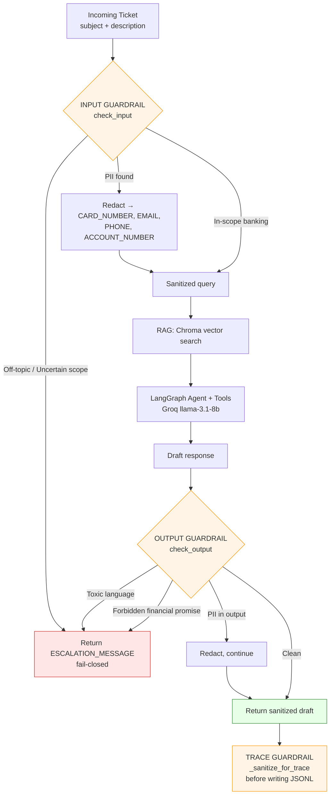
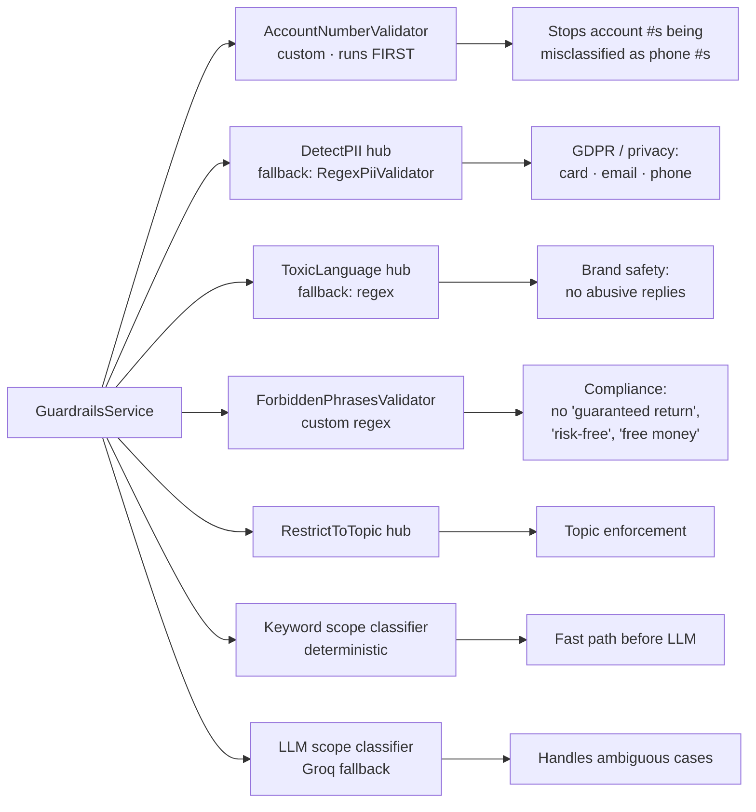
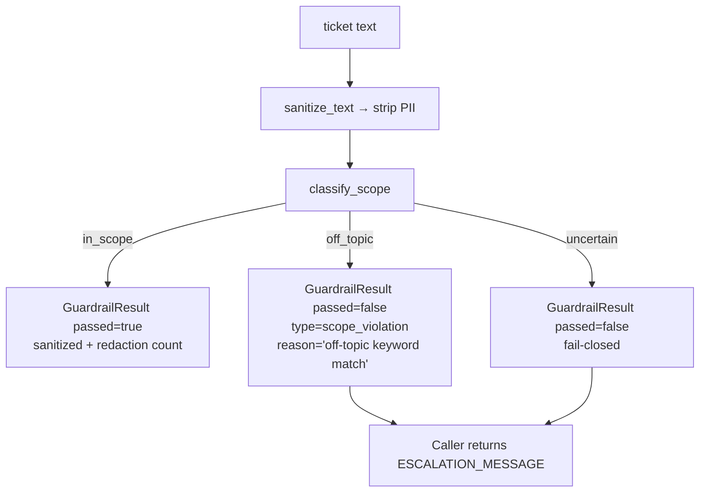
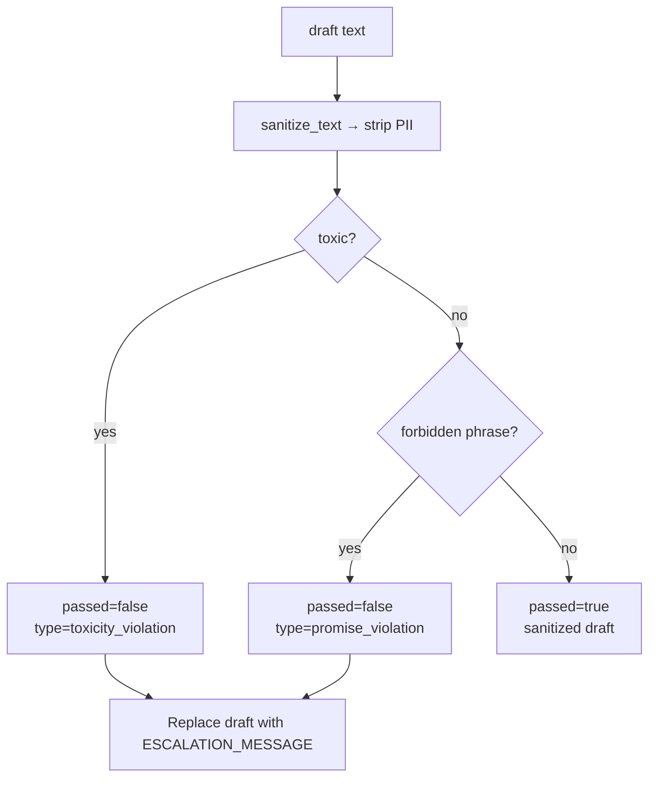

# Guardrails

Safety layer that wraps every request to the support copilot — sanitizes inputs, enforces topic scope, blocks unsafe outputs, and sanitizes traces before they're written to disk.

---

## Framework

**[Guardrails AI](https://www.guardrailsai.com)** v0.5+ with three Hub validators plus custom regex fallbacks. Implementation: [customer_support_agent/services/guardrails_service.py](../customer_support_agent/services/guardrails_service.py).

| Component | Source |
|---|---|
| `DetectPII` | Hub: `guardrails/detect_pii` |
| `ToxicLanguage` | Hub: `guardrails/toxic_language` |
| `RestrictToTopic` | Hub: `tryolabs/restricttotopic` |
| PII fallback (`RegexPiiValidator`) | custom |
| Toxicity fallback (`ToxicLanguageRegexValidator`) | custom |
| `AccountNumberValidator` | custom (always on) |
| `ForbiddenPhrasesValidator` | custom (always on) |
| Scope keyword + LLM classifier | custom (Groq fallback) |

Hub validators activate only if `GUARDRAILS_API_KEY` is set; otherwise the regex fallbacks keep everything functional. Installed validators are tracked in [.guardrails/hub_registry.json](../.guardrails/hub_registry.json).

---

## Where guardrails sit in the request flow



**Three layers:**

| Layer | Where | What it does |
|---|---|---|
| **Input** | [copilot_service.py:60](../customer_support_agent/services/copilot_service.py:60) | PII redaction + scope classification before RAG/agent |
| **Output** | [copilot_service.py:164](../customer_support_agent/services/copilot_service.py:164) + [:556](../customer_support_agent/services/copilot_service.py:556) | PII redaction + toxicity + forbidden-promise check on the draft |
| **Trace** | [copilot_service.py:562](../customer_support_agent/services/copilot_service.py:562) | Recursively sanitizes everything before it lands in `data/traces/*.jsonl` |

---

## Validator catalog



### 1. `AccountNumberValidator` — [guardrails_service.py:68](../customer_support_agent/services/guardrails_service.py:68)

- Pattern: `account.*\d{8,18}` (context-aware regex)
- Redacts to `<ACCOUNT_NUMBER>`
- **Runs first** so digit sequences don't get misclassified as phone numbers downstream.

### 2. `DetectPII` (Hub) / `RegexPiiValidator` fallback — [guardrails_service.py:92](../customer_support_agent/services/guardrails_service.py:92)

Detects and redacts:
- `CARD_NUMBER` → `\b(?:\d[ -]?){13,19}\b`
- `EMAIL_ADDRESS` → standard email regex
- `PHONE_NUMBER` → `(?:\+?\d{1,3}[\s-]?)?(?:\d[\s-]?){10,12}`

All redacted to canonical tokens (`<CARD_NUMBER>`, `<EMAIL_ADDRESS>`, `<PHONE_NUMBER>`).

### 3. `ToxicLanguage` (Hub) / regex fallback — [guardrails_service.py:124](../customer_support_agent/services/guardrails_service.py:124)

Hub: ML classifier at sentence level, threshold `0.5`.
Fallback regex: `\b(idiot|moron|stupid|fool|shut up|damn you|hell with you)\b` (case-insensitive).

### 4. `ForbiddenPhrasesValidator` — [guardrails_service.py:152](../customer_support_agent/services/guardrails_service.py:152)

Always on. Blocks financial-fraud-flavored language:

```
\bguaranteed return\b
\bguaranteed profit\b
\bfree money\b
\b100%\s+safe\b
\brisk[- ]free\b
\bzero[- ]risk\b
\bcan(?:not|'t)? lose\b
\bdouble your money\b
```

### 5. Scope classifier — [guardrails_service.py:201–498](../customer_support_agent/services/guardrails_service.py:201)

Three-stage cascade:

1. **Keyword match (deterministic)** — 40+ in-scope keywords (`account`, `bank`, `card`, `atm`, `kyc`, `billing`, …) and 10 off-topic keywords (`poem`, `recipe`, `weather`, `travel`, `code`, …).
2. **`RestrictToTopic` Hub validator** — when the keyword path is ambiguous.
3. **Groq LLM classifier** — final fallback. System prompt asks for one of three labels: `IN_SCOPE` / `OFF_TOPIC` / `UNCERTAIN`.

If no Groq key is set and keywords are ambiguous → returns `uncertain` → **fails closed**.

**Valid topics:** banking, account servicing, atm, card, kyc, fees and charges, support ticket.
**Invalid topics:** poetry, creative writing, weather, recipes, travel, song, code.

---

## Decision logic

### `check_input(text)` → [guardrails_service.py:327](../customer_support_agent/services/guardrails_service.py:327)



**Key behavior:** PII is **redacted** but does **not block** — the sanitized text continues into RAG/agent. Only scope violations block.

### `check_output(text)` → [guardrails_service.py:355](../customer_support_agent/services/guardrails_service.py:355)



Same PII rule: redacted but doesn't block.

### Result envelope

```python
@dataclass
class GuardrailResult:
    passed: bool
    sanitized_text: str
    violations: list[dict[str, Any]]
```

Violation shapes:

```python
{"type": "pii_redaction", "entity_types": ["CARD_NUMBER", "EMAIL_ADDRESS"], "count": 2}
{"type": "scope_violation", "reason": "deterministic off-topic keyword match", "label": "off_topic"}
{"type": "toxicity_violation", "matches": ["idiot"], "reason": "Draft contains hostile language."}
{"type": "promise_violation", "matches": ["guaranteed return"], "reason": "Draft makes forbidden financial guarantees."}
```

Every outcome is attached to the request trace under `guardrail_outcomes`.

---

## Configuration

| Setting | Default | Purpose |
|---|---|---|
| `GUARDRAILS_ENABLED` | `true` | Master switch; `false` swaps in a no-op service |
| `GUARDRAILS_API_KEY` | — | Hub key (free, https://hub.guardrailsai.com). Without it, fallbacks run instead. |
| `GROQ_API_KEY` | — | Powers the LLM scope-classifier fallback |

DI binding: [api/dependencies.py:36](../customer_support_agent/api/dependencies.py:36) — when disabled, returns a `GuardrailsService` with `NoOpTracer` and bypassed validators.

---

## Installing Hub validators

```bash
# one-time, requires GUARDRAILS_API_KEY
guardrails configure --token "$GUARDRAILS_API_KEY"
guardrails hub install hub://guardrails/detect_pii --quiet
guardrails hub install hub://guardrails/toxic_language --quiet
guardrails hub install hub://tryolabs/restricttotopic --quiet
```

The nightly CI workflow does this automatically when the secret is present — see [.github/workflows/nightly_evals.yml:33](../.github/workflows/nightly_evals.yml:33).

---

## Testing the guardrail layer

Offline unit tests (no LLM, ~1s): [evals/test_guardrails.py](../evals/test_guardrails.py)

```bash
uv run pytest evals/test_guardrails.py -v
```

Coverage:

| Test | Asserts |
|---|---|
| Input redacts PII without blocking | PII triggers redaction, not escalation |
| In-scope banking request passes without LLM | Keyword fast-path works |
| Off-topic request rejected without LLM | Deterministic block, no Groq call |
| Ambiguous scope can pass with LLM allow | Groq fallback path |
| Ambiguous scope fails closed when LLM uncertain | Default-deny on uncertainty |
| Safe output passes unchanged | Happy path |
| Output redacts PII without blocking | Same rule on the output side |
| Toxic output blocked | Toxicity guard fires |
| Forbidden financial promises blocked | Compliance guard fires |
| Guardrails can be disabled | `GUARDRAILS_ENABLED=false` honored |

The full eval suite ([test_full_eval.py](../evals/test_full_eval.py)) also asserts these contracts at the end-to-end level via the `no_pii_leak` and `no_forbidden_promises` DeepEval metrics.

---

## Why the design looks the way it does

- **Fail closed on scope, fail open (with redaction) on PII.** Off-topic requests are an integrity risk — block them. PII is a confidentiality risk — redact and continue, because blocking would make the bot unusable for legitimate banking queries that mention an account number.
- **Hub validators with regex fallbacks.** Hub validators are higher-quality but require a (free) key. Fallbacks keep dev/CI green without one.
- **Account-number guard runs first.** Otherwise its 8–18 digit sequences would be eaten by the phone-number regex.
- **Three-stage scope classifier.** Keyword path is free and fast for the 90% case; Hub validator handles the next chunk; Groq LLM is the last-resort tiebreaker. Saves cost without sacrificing recall.
- **Trace sanitization.** Even if a draft passed, raw inputs may have contained PII — sanitizing before write keeps `data/traces/*.jsonl` safe to share.

---

## Key files

| Concern | File |
|---|---|
| Service implementation | [customer_support_agent/services/guardrails_service.py](../customer_support_agent/services/guardrails_service.py) |
| Wire-up in copilot | [customer_support_agent/services/copilot_service.py](../customer_support_agent/services/copilot_service.py) |
| DI binding | [customer_support_agent/api/dependencies.py](../customer_support_agent/api/dependencies.py) |
| Settings | [customer_support_agent/core/settings.py](../customer_support_agent/core/settings.py) |
| Hub registry | [.guardrails/hub_registry.json](../.guardrails/hub_registry.json) |
| Unit tests | [evals/test_guardrails.py](../evals/test_guardrails.py) |
| CI install step | [.github/workflows/nightly_evals.yml](../.github/workflows/nightly_evals.yml) |
